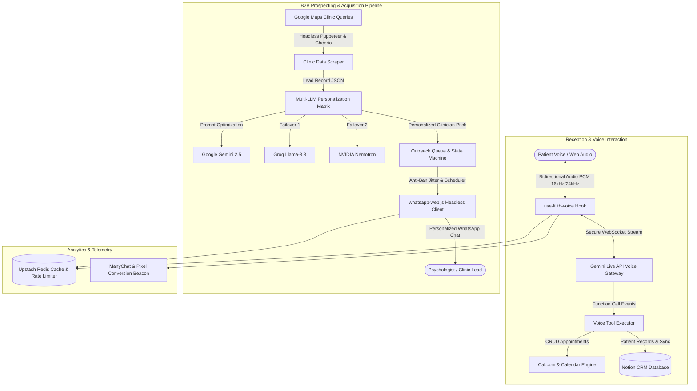

# 🧠 Psicomarketing — AI Clinical Receptionist, Voice Agent & Automated B2B Prospecting Suite

<p align=center>
  
  
  
  
  
  
  
  
</p>

---

## 📌 Executive Overview

**Psicomarketing** is an intelligent operational and growth ecosystem engineered for clinical psychologists, therapy practices, and mental healthcare clinics. It unites two high-leverage domains:

1. **Gaby — Autonomous Real-Time Voice Receptionist:** Powered by Google Gemini Multimodal Live WebSocket APIs, Web Audio PCM streams, and function calling tools. Gaby conducts natural vocal conversations with patients, checks schedule availability, confirms or cancels appointments, and synchronizes live events into Cal.com and Notion databases in real time.
2. **Autonomous B2B Lead Scraping & Multi-LLM Prospecting Engine:** Scrapes clinical targets from Google Maps via Cheerio & Puppeteer, enriches prospect data with a cascading fallback pipeline (Gemini 3.5 Flash → Groq Llama-3.3 → NVIDIA Nemotron), and orchestrates human-like outreach through headless WhatsApp Web automation with anti-ban safeguards.

---

## 🏗️ System Architecture



---

## ✨ Key Features & Capabilities

- 🎙️ **Real-Time Gemini Live Voice Receptionist:** Direct bidirectional voice streaming over WebSockets with sub-second latency, barge-in / interruption handling, and interactive animated 3D visualizer orbs.
- 📅 **Automated Schedule Management & Tool Calling:** Gaby invokes programmatic tools directly from spoken dialogue to check open consultation slots, book new sessions, reschedule patients, and cancel bookings.
- 🕵️ **Targeted Clinic Prospecting Crawler:** Extracts high-intent clinical leads (clinic name, phone numbers, geo-coordinates, reviews, and websites) across multiple target cities.
- ⚡ **Multi-LLM Cascading Resilience:** Fault-tolerant AI personalization that cascades across Google Gemini, Groq Llama 3.3, and NVIDIA microservices so lead batch runs never stall.
- 💬 **Headless WhatsApp Web Outreach:** Runs persistent WhatsApp Web instances with humanized typing emulation, variable jitter delays, QR code terminal authentication, and configurable business hours.
- 📊 **Interactive ROI & Clinic Calculator:** Built-in interactive financial calculator demonstrating patient retention, automated appointment recaptures, and ROI for solo practices and group clinics.
- 📈 **Integrated CRM & Analytics Sync:** Automatic two-way synchronization of booked consultations and conversation status into Notion databases and Upstash Redis.

---

## 🛠️ Technology Stack

| Layer | Technologies |
|---|---|
| **Frontend Framework** | Next.js 16.3 (App Router), React 19.2.4, Tailwind CSS v4, Radix UI |
| **Voice & Multimodal AI** | Google Gemini Live Multimodal WebSocket API, Web Audio API (PCM 16kHz/24kHz) |
| **Outreach & Text LLMs** | Google Gemini 2.5 Flash, Groq (llama-3.3-70b-versatile), NVIDIA Nemotron |
| **Browser Automation & Scraping** | Puppeteer 24, Cheerio 1.2, whatsapp-web.js |
| **Integrations & CRM** | Notion API (@notionhq/client), Cal.com API, ManyChat Webhooks |
| **Data & State Storage** | Upstash Redis, Supabase (@supabase/supabase-js) |
| **Audio & Graphics** | Three.js, Lucide React, Custom CSS Keyframe Shader Orbs |

---

## 📂 Project Structure

```
psicomarketing/
├── scripts/
│   ├── scrapers/
│   │   └── groq_personalizer.js     # AI personalized pitch generator with fallback
│   └── whatsapp/
│       ├── index.js                 # Headless WhatsApp Web dispatch runner
│       └── psicologos_scraper.js    # Google Maps scraping script
├── src/
├── app/
│   │   ├── api/                     # Voice proxy, Cal.com & webhook routes
│   │   ├── checkout/                # Self-service checkout & subscription
│   │   ├── dashboard/               # Administrative pipeline management
│   │   ├── globals.css              # Custom styling & dynamic keyframe animations
│   │   └── page.jsx                 # High-converting clinical landing page
│   ├── components/
│   │   ├── live-voice-agent-demo.jsx# Interactive voice demo with real-time audio orb
│   │   ├── plan-calculator.jsx      # Dynamic ROI & savings calculator
│   │   ├── bot-flow-scene.jsx       # Interactive visual workflow simulator
│   │   └── ui/                      # Radix-backed atomic UI components
│   ├── hooks/
│   │   └── use-lilith-voice.ts      # WebSocket PCM audio capture & Gemini Live manager
│   ├── lib/
│   │   ├── calcom.ts                # Cal.com scheduling API client
│   │   ├── gemini.ts                # Gemini generative AI client
│   │   └── manychat.ts              # Omnichannel lead synchronization
│   └── services/
│       └── notion.ts                # Clinical appointment Notion CRM integration
├── package.json
└── tsconfig.json
```

---

## 🚀 Getting Started

### Prerequisites

- **Node.js**: v18.18+ or v20+
- **Chrome / Chromium**: For Puppeteer & WhatsApp Web session automation

### 1. Clone the Repository

```bash
git clone https://github.com/felipedutrag/psicomarketing.git
cd psicomarketing
```

### 2. Configure Environment Variables

Create a .env.local file:

```env
# Gemini Live & Multimodal
GEMINI_API_KEY=your_gemini_api_key

# Secondary LLMs for Prospecting
GROQ_API_KEY=your_groq_api_key

# Integrations
NOTION_API_KEY=your_notion_key
NOTION_DATABASE_ID=your_database_id
CALCOM_API_KEY=your_calcom_key

# Redis & Persistence
UPSTASH_REDIS_REST_URL=your_upstash_url
UPSTASH_REDIS_REST_TOKEN=your_upstash_token
```

### 3. Run Development Server

```bash
npm install
npm run dev
```

### 4. Execute the Prospecting Pipeline

```bash
# Scrape leads and generate personalized pitches
npm run pipeline

# Authenticate and run WhatsApp outreach
npm run whatsapp
```

---

## 👤 Author

**Felipe Dutra**  
- **GitHub:** [@felipedutrag](https://github.com/felipedutrag)  
- **Email:** [felipedutra@outlook.com](mailto:felipedutra@outlook.com)
